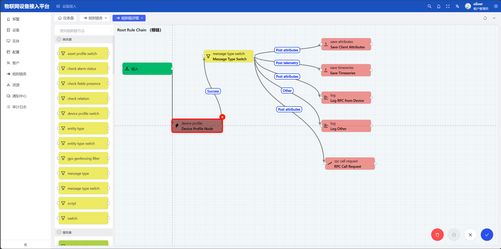
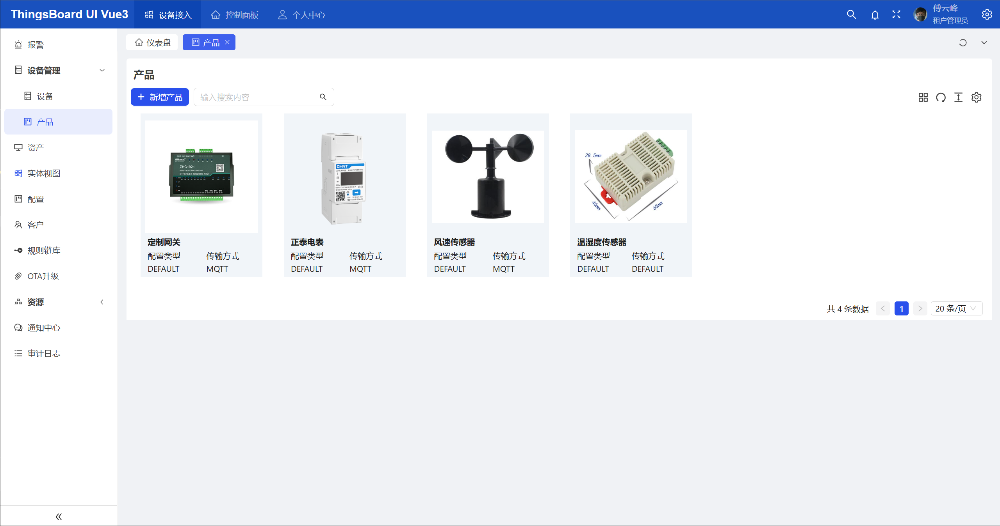
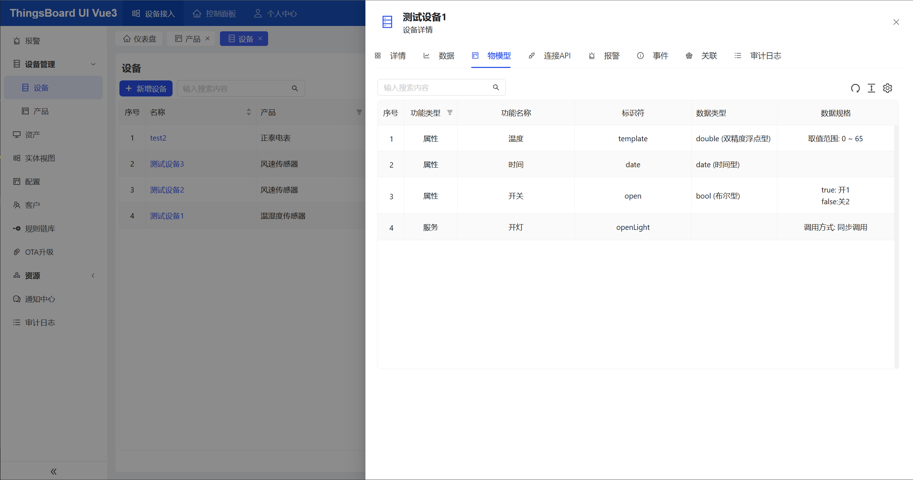
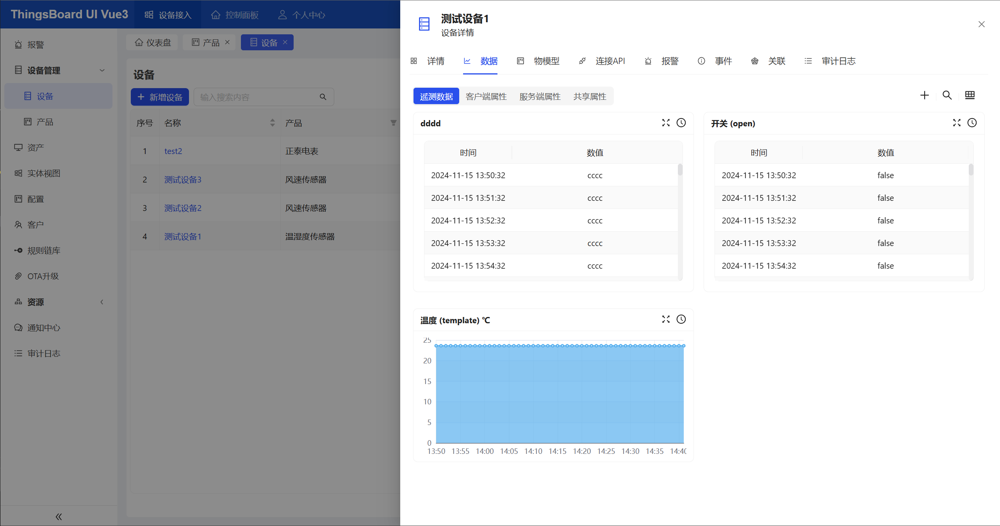
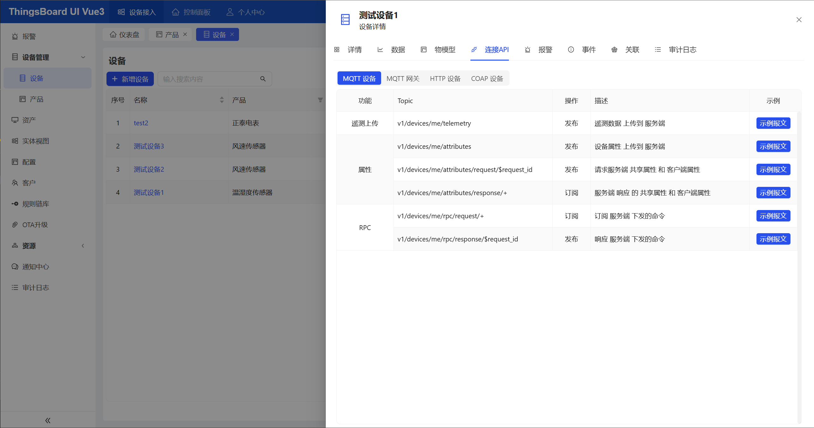

# thingsboard-ui-vue


ThingsBoard凭借其优秀的性能和高效的性能得到了广大开发者的认可,但基于Angular的前端不符合中国的用户习惯， 本项目为基于Vue3开发的 ThingsBoard 前台

📌 规则链代码已全部开放

📌 物模型已完成

📌 web组态 开发中...

📌 大屏组态 开发中...

📌 uniapp小程序 开发中...

📌 仪表板 开发中...


  

🎉 请大家持续关注，watch、star、fork 一键三连

## 预览地址
  thingsboard:   http://thingsboard.yantsing.com/
   
   用户名：1069035666@qq.com (我的邮箱)

   密码: 17621315188 (我的微信，欢迎讨论交流)


## Thingsbaord
 
   thingsboard：V3.8.1，持续跟进更新中


## 使用技术

- [Vite](https://vitejs.dev/) 
- [Vue-v3](https://cn.vuejs.org/) 
- [Vue-Router-v4](https://next.router.vuejs.org/) 
- [JeeSite Vue3](https://gitee.com/thinkgem/jeesite-vue/)
- [Vue-Vben-Admin](https://jeesite.com/front/vben-admin/)
- [Ant-Design-Vue](https://antdv.com/components/overview-cn/)
- [AntV x6](https://x6.antv.antgroup.com/)
  
## 启动
- 打开 .env.development 文件，修改后台接口：
  ```bash
  # 代理设置，可配置多个，不能换行，格式：[访问接口的根路径, 代理地址, 是否保持Host头]
   VITE_PROXY = [["/api","http://127.0.0.1:8080/api",false]]
  # 访问接口的根路径
   VITE_GLOB_API_URL =
- 运行、打包
   ```bash
   # 安装依赖
   yarn install
   # 开发环境运行
   yarn serve
   # 编译打包后运行访问
   yarn preview
   # 打包
   yarn build
## 规则引擎
- [AntV x6](https://x6.antv.antgroup.com/)
  



## 预览图片








## 🙋‍♂️联系我们

<left class ='img'>

</left>
