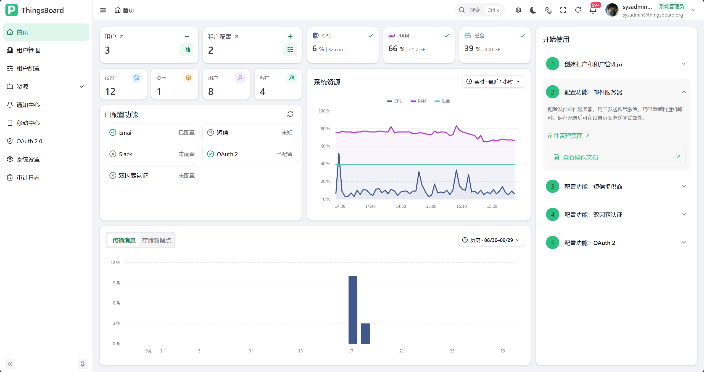
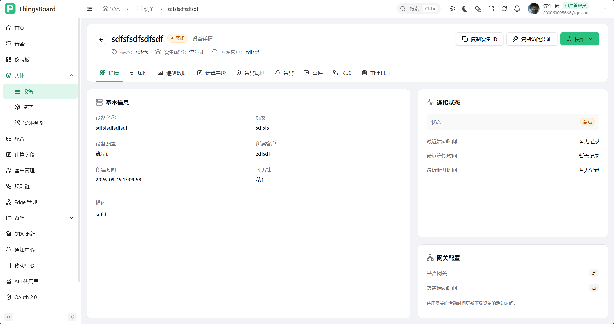
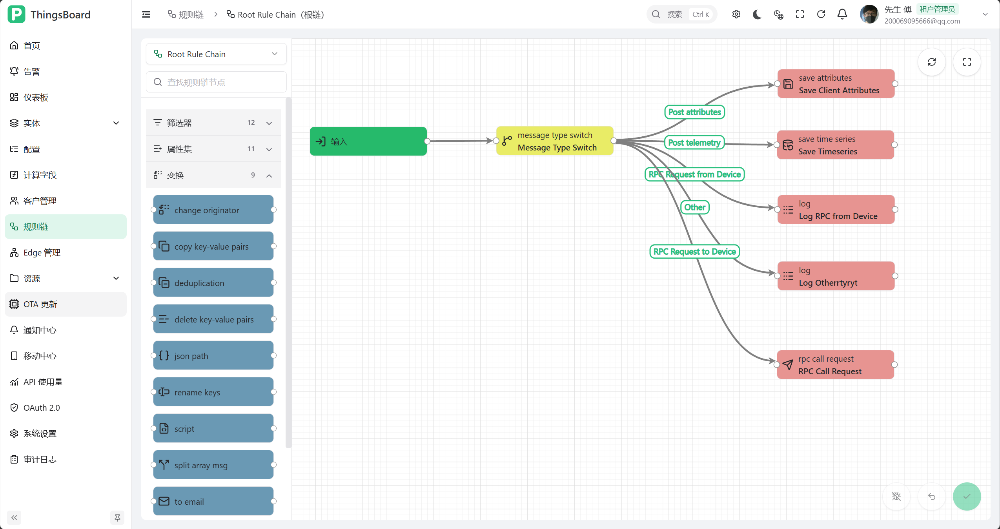

<div align="center">
  
  <h1>ThingsBoard UI Vue3</h1>
  <p>A Vue 3 management frontend for ThingsBoard, rebuilt on Vben Admin v5.</p>
</div>

**English** | [简体中文](./README.zh-CN.md)

[](./package.json)
[](https://thingsboard.io/)
[](https://github.com/vbenjs/vue-vben-admin)

## Overview

ThingsBoard UI Vue3 connects a Vue-based administration interface to an existing [ThingsBoard](https://thingsboard.io/) backend. This edition continues with Vben Admin v5, a pnpm workspace, shared components, and antdv-next.

This repository contains the frontend. Run ThingsBoard separately and sign in with an account from your backend. Menus and operations depend on the user's ThingsBoard role and the APIs enabled by that backend.

## Demo site

Address: [https://thingsboard.pincore.cn](https://thingsboard.pincore.cn)

The demo accounts use the ThingsBoard defaults:

| Role | Username | Password |
| --- | --- | --- |
| Tenant administrator | `tenant@thingsboard.org` | `tenant` |
| Customer user | `customer@thingsboard.org` | `customer` |
| System administrator | `sysadmin@thingsboard.org` | `sysadmin` |

These are the [ThingsBoard default credentials](https://thingsboard.io/docs/installation/ubuntu/#step-7-start-thingsboard). For your own installation, tenant/customer demo accounts require demo data; otherwise use the accounts created on your backend.

## Versions and migration

| Component | Version / scope |
| --- | --- |
| ThingsBoard backend | `4.3.1.5` |
| Administration framework | Vben Admin v5 |
| Application directory | `apps/web-ui` |
| Framework migration branch | `vben` |

The frontend package uses the three-part version `4.3.1`; the backend target is `4.3.1.5`. This README describes the Vben v5 edition. Other backend versions need their own compatibility checks.

When migrating from the previous frontend, use this workspace's environment files and commands. The application has moved from the repository root to `apps/web-ui`. Third-party dependency versions are managed through pnpm Catalog. The old `VITE_PROXY` configuration is replaced by `VITE_TB_TARGET` for local development.

## Features

- **Role-based home pages:** system administrator, tenant administrator, and customer user navigation, summaries, device maps, and API usage views.
- **Entities and profiles:** devices, assets, entity views, device/asset profiles, customer assignments, bulk operations, and device import.
- **Entity details:** attributes, telemetry, events, credentials, calculated fields, and alarm-rule configuration.
- **Tenants and customers:** tenants, tenant profiles, administrators, customers, and customer users.
- **Rule chains:** an AntV X6 graph editor, node configuration forms, and script testing tools.
- **Alarms and notifications:** alarm actions, audit logs, notification recipients, templates, rules, delivery records, and WebSocket updates.
- **Resources:** dashboard records and customer assignments, widget bundles/types, images, SCADA symbols, JavaScript resources, and OTA packages.
- **Administration:** queues, OAuth 2.0 clients/domains, security and mail settings, mobile-center configuration, and edge-management pages.
- **Accounts and UI:** account activation, password reset, profile and API-key management, Chinese/English localization, and configurable light/dark themes.

Dashboard support here covers management of dashboard records and assignments. A full visual dashboard designer/player and video-surveillance workflows are not listed as completed features of this edition.

## Screenshots

### System administrator home



### Device details



### Rule chain editor



## Technology

| Area | Libraries |
| --- | --- |
| Framework and language | Vue 3.5, TypeScript 6, Vben Admin v5 |
| Tooling | Vite 8, pnpm 11, Turborepo |
| UI and styling | antdv-next, Tailwind CSS 4 |
| State and navigation | Pinia 4, Vue Router 5 |
| Graphs and charts | AntV X6 3, ECharts 6 |
| Editors and data | Monaco Editor, Protobuf, SheetJS |
| Networking and localization | Axios, WebSocket, Vue I18n 11 |

See [pnpm-workspace.yaml](./pnpm-workspace.yaml) for dependency declarations and [pnpm-lock.yaml](./pnpm-lock.yaml) for resolved versions. Third-party packages use `catalog:` references; local packages use `workspace:*`.

## Getting started

### 1. Prepare the environment

- Node.js `^22.18.0 || ^24.12.0`, as defined in [package.json](./package.json). [.node-version](./.node-version) selects `24.16.0`.
- pnpm `11.16.0`, matching the repository's `packageManager` field.
- A reachable ThingsBoard `4.3.1.5` backend and a valid user account.

### 2. Clone and install

```bash
git clone --branch vben https://github.com/oliver225/thingsboard-ui-vue3.git
cd thingsboard-ui-vue3
npm install --global pnpm@11.16.0
pnpm install --frozen-lockfile
```

Use the branch containing this Vben v5 workspace. Run all commands below from the repository root.

### 3. Configure the backend

Create `apps/web-ui/.env.development.local`:

```dotenv
VITE_TB_TARGET=http://localhost:8080
```

Use the backend origin without an `/api` suffix. The [Vite proxy](./apps/web-ui/vite.config.ts) forwards `/api` requests, including WebSocket connections, while preserving the path. `http://localhost:8080` is also the default when the variable is omitted. Local override files are ignored by Git.

### 4. Start the frontend

```bash
pnpm dev
```

Open [http://localhost:3001](http://localhost:3001) and use your ThingsBoard credentials. The development configuration disables the mock backend.

## Build and deploy

```bash
pnpm check:thingsboard
pnpm build
```

The static output is `apps/web-ui/dist`. Production defaults to the `/` base path, `/api` backend requests, and hash routing. `VITE_TB_TARGET` configures the development proxy; production needs its own reverse proxy.

Copy the **contents** of `apps/web-ui/dist` to your web server's document root. This example serves the frontend on a dedicated host at `/`. Replace the document root, host name, and backend address for your environment. Place both blocks inside Nginx's `http` context:

```nginx
map $http_upgrade $connection_upgrade {
    default upgrade;
    ''      close;
}

server {
    listen 80;
    server_name thingsboard-ui.example.com;
    root /var/www/thingsboard-ui;
    index index.html;

    location /api/ {
        proxy_pass http://127.0.0.1:8080;
        proxy_http_version 1.1;
        proxy_set_header Host $host;
        proxy_set_header X-Real-IP $remote_addr;
        proxy_set_header X-Forwarded-For $proxy_add_x_forwarded_for;
        proxy_set_header X-Forwarded-Proto $scheme;
        proxy_set_header Upgrade $http_upgrade;
        proxy_set_header Connection $connection_upgrade;
        proxy_read_timeout 3600s;
    }

    location / {
        try_files $uri $uri/ /index.html;
    }
}
```

The proxy preserves `/api` and forwards the headers needed for [WebSocket connections](https://nginx.org/en/docs/http/websocket.html). Configure HTTPS with your deployment's certificates. For a subpath such as `/vue/`, also adjust `VITE_BASE`, the static-file mapping, and root-relative branding assets before rebuilding.

`pnpm preview` serves the build for local inspection. The [Dockerfile](./scripts/deploy/Dockerfile) builds the same application, but the bundled [Nginx configuration](./scripts/deploy/nginx.conf) only serves static files; add the backend proxy when deploying it.

## Commands

| Command | Purpose |
| --- | --- |
| `pnpm dev` | Start the ThingsBoard development frontend |
| `pnpm build` | Build the ThingsBoard frontend |
| `pnpm preview` | Preview the production build locally |
| `pnpm build:analyze` | Build with bundle analysis |
| `pnpm check:thingsboard` | Check application types |
| `pnpm check:type` | Run workspace type checks |
| `pnpm lint` | Run the repository lint workflow |
| `pnpm format` | Format the code |
| `pnpm dev:docs` / `pnpm build:docs` | Serve / build the inherited framework documentation |

## Repository layout

```text
apps/
  web-ui/                 ThingsBoard web application
    src/
      adapter/            Form, table, and UI adapters
      api/                Authentication and ThingsBoard API clients
      components/         Shared business components
      locales/            Application translations
      router/             Routes and access guards
      store/              Application state
      views/_core/        Login, profile, and role home pages
      views/tb/           ThingsBoard management pages
  agent/                  Reserved application scaffold
  uni-app/                Reserved application scaffold
packages/                 Shared Vben and application UI packages
internal/                 Build, lint, TypeScript, and theme configuration
scripts/                  Workspace tooling and deployment files
docs/                     Inherited framework documentation
pnpm-workspace.yaml       Workspace packages and dependency catalog
```

## Branding and preferences

Set the application title in `apps/web-ui/.env`. Configure branding, copyright/ICP details, and default preferences in [apps/web-ui/src/preferences.ts](./apps/web-ui/src/preferences.ts). The logo and login contact images are in `apps/web-ui/public`.

Preferences persist in the browser and take precedence over defaults. When changing defaults for existing users, use a targeted preference migration or reset preferences; editing defaults alone does not necessarily replace cached values.

## Contact and contributions

- Maintainer: [oliver225](https://github.com/oliver225)
- Issues: [thingsboard-ui-vue3/issues](https://github.com/oliver225/thingsboard-ui-vue3/issues)
- Email: [1069035666@qq.com](mailto:1069035666@qq.com)
- WeChat: `17621315188`


For bug reports, include reproduction steps, the frontend commit, backend version, and user role. For pull requests, run the relevant type checks and lint workflow, and use a conventional commit message such as `fix(thingsboard-ui): ...`.

## Acknowledgements and licensing

Built on [Vue Vben Admin](https://github.com/vbenjs/vue-vben-admin) and integrated with [ThingsBoard](https://thingsboard.io/). Framework usage is documented in the [Vben documentation](https://doc.vben.pro/).

Copyright (c) 2026 oliver225 for original project contributions.

This project is licensed under [GPL-3.0-only](./LICENSE). Commercial use, modification, and redistribution are permitted under its terms.

Third-party code retains its original copyrights and licenses. See [Vben MIT](./LICENSES/Vben-MIT.txt) and [Apache-2.0](./LICENSES/Apache-2.0.txt).
