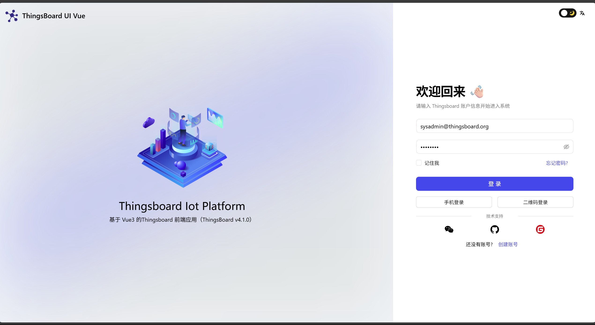

# ThingsBoard UI Vue

基于 Vue 3 的 [ThingsBoard](https://thingsboard.io/)（v4.3.0）前端适配项目，使用 Vite、TypeScript 和 Ant Design Vue 构建。基于 [vue-vben-admin](https://github.com/vbenjs/vue-vben-admin)。

[English](./README.md)

> ⭐ 如果本项目对你有帮助，欢迎 watch、star、fork 一键三连！

## 在线演示

- **地址：** http://thingsboard.yantsing.com/vue/
- **用户名：** 1069035666@qq.com
- **密码：** 17621315188

> 演示环境连接的是真实的 ThingsBoard v4.3.0 实例。

## 功能特性

- **设备管理** — 设备列表、新增、编辑、删除、批量导入
- **资产管理** — 资产列表、配置、批量导入
- **客户管理** — 管理客户及其设备、资产、仪表板
- **仪表板** — 数据可视化仪表板，支持多种部件
- **规则引擎** — 基于 AntV X6 的可视化规则链编辑器
- **实体视图** — 对设备/资产遥测数据的自定义视图
- **OTA 升级** — 管理设备固件/软件升级包
- **告警管理** — 告警列表、筛选与确认
- **审计日志** — 完整的系统操作审计记录
- **通知中心** — 通知规则、模板、接收人及发送记录
- **资源库** — 部件包、图像库、组态库、JavaScript 库
- **系统设置** — 系统级配置（SYS_ADMIN）
- **多语言** — 中文/英文，运行时切换
- **深色模式** — 完整深色主题支持
- **响应式布局** — 适配不同屏幕尺寸

## 技术栈

| 类别 | 库 / 版本 |
|---|---|
| 框架 | Vue 3.5 + TypeScript 5 |
| 构建工具 | Vite 6 |
| UI 组件库 | Ant Design Vue 4 |
| 状态管理 | Pinia 2 |
| 路由 | Vue Router 4 |
| 规则引擎图形 | AntV X6 2 |
| 图表 | ECharts 5 |
| 代码编辑器 | Monaco Editor |
| 国际化 | Vue I18n 11 |
| HTTP | Axios |
| CSS | UnoCSS + Less |

## ThingsBoard 版本兼容

| UI 版本 | ThingsBoard 版本 |
|---|---|
| v4.x（当前分支） | v4.3.0 |
| v3.x | v3.x（见其他分支） |

## 环境要求

- Node.js >= 18
- pnpm >= 8

## 快速开始

**1. 克隆仓库**

```bash
git clone https://github.com/oliver225/thingsboard-ui-vue.git
cd thingsboard-ui-vue
```

**2. 安装依赖**

```bash
pnpm install
```

**3. 配置环境**

编辑 `.env.development`：

```env
# 代理配置：[访问路径前缀, 目标地址, 是否保持Host头]
VITE_PROXY = [["/api","http://127.0.0.1:8080/api",false]]
VITE_GLOB_API_URL = /api
```

将 `http://127.0.0.1:8080` 替换为你的 ThingsBoard 后端地址。

**4. 启动开发服务器**

```bash
pnpm dev
```

浏览器访问 http://localhost:5173

**5. 生产构建**

```bash
pnpm build
```

产物输出到 `dist/` 目录，部署到 Nginx 等静态服务器，并将 `/api` 反向代理到 ThingsBoard 后端。

## Nginx 配置示例

```nginx
server {
    listen       80;
    server_name  localhost;

    access_log  /var/log/nginx/thingsboard.access.log  main;

    # Vue 前端（部署在 /vue 路径下）
    location /vue {
        alias  /opt/thingsboard/vue;
        index  index.html;
        try_files $uri $uri/vue /vue/index.html;
    }

    # ThingsBoard 后端
    location / {
        proxy_set_header  X-Real-IP $remote_addr;
        proxy_set_header  Host  $http_host;
        proxy_pass  http://127.0.0.1:18080;
        proxy_max_temp_file_size 0;
    }

    # REST API
    location /api {
        proxy_set_header  X-Real-IP $remote_addr;
        proxy_set_header  Host  $http_host;
        proxy_pass  http://127.0.0.1:18080/api;
        proxy_max_temp_file_size 0;
    }

    # WebSocket
    location /api/ws {
        proxy_pass http://127.0.0.1:18080;
        proxy_http_version 1.1;
        proxy_set_header Upgrade $http_upgrade;
        proxy_set_header Connection "upgrade";
    }
}
```

## 脚本命令

| 命令 | 说明 |
|---|---|
| `pnpm dev` | 启动开发服务器 |
| `pnpm build` | 生产环境打包 |
| `pnpm preview` | 本地预览生产构建 |
| `pnpm type:check` | TypeScript 类型检查 |
| `pnpm lint:all` | ESLint + Prettier + Stylelint |

## 项目结构

```
src/
├── api/            # Axios 接口（对应 ThingsBoard REST API）
├── assets/         # 静态资源（图标、图片、SVG）
├── components/     # 公共复用组件
├── enums/          # TypeScript 枚举
├── hooks/          # Vue 组合式函数
├── layouts/        # 应用布局
├── locales/        # 国际化翻译文件
│   └── lang/
│       ├── en/     # 英文翻译
│       └── zh-CN/  # 中文翻译
├── router/         # 路由定义
├── store/          # Pinia 状态
├── utils/          # 工具函数
└── views/
    └── tb/         # ThingsBoard 功能页面
        ├── alarm/
        ├── asset/
        ├── customer/
        ├── dashboard/
        ├── device/
        ├── notification/
        ├── ruleChain/
        └── ...
```

## 预览截图




## 联系我们

微信：**17621315188**，欢迎交流讨论。

邮箱：1069035666@qq.com


## 开源协议

Apache License 2.0
